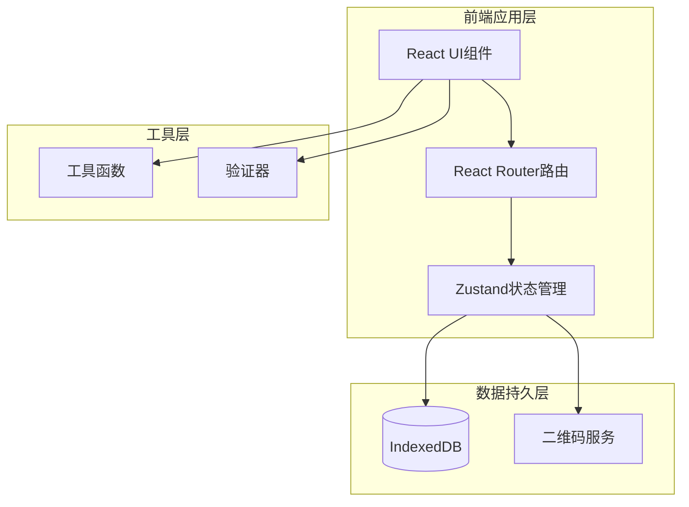

# 单片机硬件信息管理工具 - 技术架构文档

## 1. 架构设计



## 2. 技术栈说明

### 2.1 前端技术栈
- **框架**: React 18.3.1
- **构建工具**: Vite 5.x
- **样式方案**: Tailwind CSS 3.4.x
- **路由**: React Router DOM 6.x
- **状态管理**: Zustand 4.x
- **UI组件库**:
  - Lucide React (图标库)
  - Framer Motion (动画库)
- **二维码生成**: qrcode.react 3.x
- **日期处理**: date-fns 3.x
- **唯一ID生成**: nanoid 5.x

### 2.2 数据存储方案
- **主存储**: IndexedDB
  - 支持大量结构化数据存储
  - 异步API,不阻塞主线程
  - 支持索引和快速查询
- **备用方案**: LocalStorage (用于存储应用配置)

### 2.3 无后端架构
- 所有数据存储在客户端
- 二维码在前端生成
- 数据导出为JSON格式
- 适合单机或小团队使用

## 3. 路由定义

| 路由路径 | 页面组件 | 功能描述 |
|---------|---------|---------|
| `/` | DeviceManagement | 设备管理主页(重定向) |
| `/devices` | DeviceManagement | 设备管理页面,展示设备列表 |
| `/devices/add` | AddDevice | 添加新设备页面 |
| `/devices/edit/:id` | EditDevice | 编辑设备页面 |
| `/devices/:id` | DeviceDetail | 设备详情页面 |

## 4. 数据模型定义

### 4.1 设备信息数据模型

```typescript
// 设备类别枚举
enum DeviceCategory {
  SENSOR = 'SENSOR',      // 传感器类
  BOARD = 'BOARD',        // 核心板类
  COMM = 'COMM',          // 通信模块类
  POWER = 'POWER',        // 电源模块类
  STORAGE = 'STORAGE',    // 存储模块类
  OTHER = 'OTHER'         // 其他
}

// 接口类型枚举
enum InterfaceType {
  UART = 'UART',
  SPI = 'SPI',
  I2C = 'I2C',
  CAN = 'CAN',
  USB = 'USB',
  ETHERNET = 'Ethernet',
  WIFI = 'WiFi',
  BLUETOOTH = 'Bluetooth',
  OTHER = 'Other'
}

// 设备接口定义
interface Device {
  // 基础信息(必填)
  id: string;                    // 设备ID: {CATEGORY}-{YYYYMMDD}-{序号}
  name: string;                  // 设备名称
  category: DeviceCategory;      // 设备类别
  purchaseDate: string;          // 购买时间 (ISO 8601格式)
  storageDate: string;           // 入库时间 (ISO 8601格式)

  // 硬件规格信息(可选)
  coreModel?: string;            // 核心型号(如STM32F103, ESP32)
  macAddress?: string;           // MAC地址
  firmwareVersion?: string;     // 固件版本
  storageCapacity?: string;      // 存储容量(如256KB, 1MB)
  interfaces?: InterfaceType[];  // 接口类型
  workingVoltage?: string;       // 工作电压(如3.3V, 5V)
  powerConsumption?: string;     // 功耗参数
  package?: string;              // 封装形式(如LQFP48, BGA)
  manufacturer?: string;         // 生产厂家

  // 元数据
  createdAt: string;             // 创建时间
  updatedAt: string;             // 最后更新时间
  notes?: string;                // 备注信息
}

// 应用状态接口
interface AppState {
  devices: Device[];
  currentFilter: DeviceCategory | 'ALL';
  searchQuery: string;
}

// 统计信息接口
interface Statistics {
  totalDevices: number;
  categoryCounts: Record<DeviceCategory, number>;
  recentAdditions: number;        // 最近7天新增
}
```

### 4.2 IndexedDB数据库结构

**数据库名称**: `HardwareManagementDB`
**数据库版本**: 1

**对象存储(Object Store)**:

1. **devices** - 设备信息表
   - 主键: `id`
   - 索引:
     - `category` - 设备类别索引
     - `createdAt` - 创建时间索引
     - `purchaseDate` - 购买时间索引
     - `name` - 设备名称索引

```javascript
// IndexedDB 初始化
const DB_SCHEMA = {
  name: 'HardwareManagementDB',
  version: 1,
  stores: {
    devices: {
      keyPath: 'id',
      indexes: [
        { name: 'category', keyPath: 'category', options: { unique: false } },
        { name: 'createdAt', keyPath: 'createdAt', options: { unique: false } },
        { name: 'purchaseDate', keyPath: 'purchaseDate', options: { unique: false } },
        { name: 'name', keyPath: 'name', options: { unique: false } }
      ]
    }
  }
};
```

### 4.3 ID生成规则实现

```typescript
// 设备ID生成函数
function generateDeviceId(category: DeviceCategory): string {
  const date = new Date();
  const dateStr = format(date, 'yyyyMMdd');

  // 查询当天该类别已有的设备数量
  const todayDevices = getDevicesByDateAndCategory(date, category);
  const sequence = String(todayDevices.length + 1).padStart(3, '0');

  return `${category}-${dateStr}-${sequence}`;
}
```

## 5. 核心功能模块设计

### 5.1 二维码生成模块

**功能描述**: 根据设备ID生成二维码,包含设备基本信息

**二维码内容格式**:
```json
{
  "id": "SENSOR-20260625-001",
  "name": "温度传感器DHT11",
  "category": "SENSOR",
  "url": "/devices/SENSOR-20260625-001"
}
```

**技术实现**:
- 使用 `qrcode.react` 库生成二维码
- 支持 SVG 和 Canvas 两种渲染方式
- 二维码尺寸: 256x256 像素
- 支持下载为 PNG 格式

### 5.2 数据导入导出模块

**导出功能**:
- 导出格式: JSON
- 导出范围: 全部设备 / 按类别导出 / 按时间范围导出
- 文件命名: `hardware_backup_{YYYYMMDD_HHmmss}.json`

**导入功能**:
- 支持导入 JSON 格式的备份文件
- 导入时检查ID冲突
- 提供"覆盖"和"跳过"两种冲突处理方式

### 5.3 搜索与筛选模块

**搜索功能**:
- 搜索字段: 设备名称、ID、核心型号、MAC地址
- 实时搜索,输入即响应
- 高亮匹配文本

**筛选功能**:
- 按类别筛选
- 按购买时间范围筛选
- 按入库时间范围筛选
- 组合筛选支持

## 6. 项目目录结构

```
hardware-management/
├── public/
│   └── favicon.ico
├── src/
│   ├── components/
│   │   ├── common/
│   │   │   ├── Button.tsx
│   │   │   ├── Card.tsx
│   │   │   ├── Input.tsx
│   │   │   ├── Modal.tsx
│   │   │   ├── Toast.tsx
│   │   │   └── QRCode.tsx
│   │   ├── devices/
│   │   │   ├── DeviceCard.tsx
│   │   │   ├── DeviceForm.tsx
│   │   │   ├── DeviceList.tsx
│   │   │   ├── DeviceFilter.tsx
│   │   │   └── DeviceSearch.tsx
│   │   └── layout/
│   │       ├── Header.tsx
│   │       ├── Sidebar.tsx
│   │       └── Layout.tsx
│   ├── pages/
│   │   ├── DeviceManagement.tsx
│   │   ├── AddDevice.tsx
│   │   ├── EditDevice.tsx
│   │   └── DeviceDetail.tsx
│   ├── store/
│   │   └── useDeviceStore.ts
│   ├── db/
│   │   └── database.ts
│   ├── utils/
│   │   ├── idGenerator.ts
│   │   ├── validators.ts
│   │   ├── exportImport.ts
│   │   └── constants.ts
│   ├── types/
│   │   └── device.ts
│   ├── App.tsx
│   ├── main.tsx
│   └── index.css
├── .gitignore
├── index.html
├── package.json
├── postcss.config.js
├── tailwind.config.js
├── tsconfig.json
└── vite.config.ts
```

## 7. 性能优化策略

### 7.1 数据加载优化
- 使用虚拟列表(Virtual List)处理大量设备展示
- 分页加载,默认每页20条
- IndexedDB索引优化查询性能

### 7.2 渲染优化
- React.memo 优化组件渲染
- useMemo 和 useCallback 减少不必要计算
- 懒加载路由组件

### 7.3 存储优化
- 定期清理过期的临时数据
- 数据压缩导出选项
- 索引优化查询效率

## 8. 安全考虑

### 8.1 数据验证
- 前端表单验证
- MAC地址格式验证
- 日期范围验证
- 输入内容XSS过滤

### 8.2 数据完整性
- IndexedDB事务保护
- 数据备份提醒
- 关键操作二次确认

## 9. 浏览器兼容性

**目标浏览器**:
- Chrome 90+
- Firefox 88+
- Safari 14+
- Edge 90+

**所需API**:
- IndexedDB 2.0
- CSS Grid Layout
- ES2020+
- Canvas API (二维码生成)